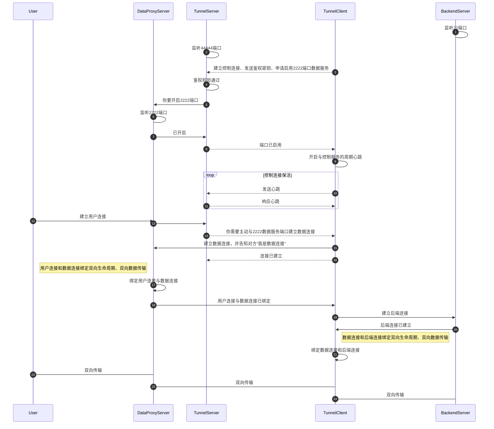
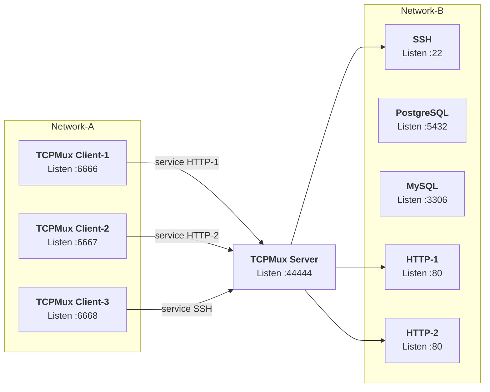
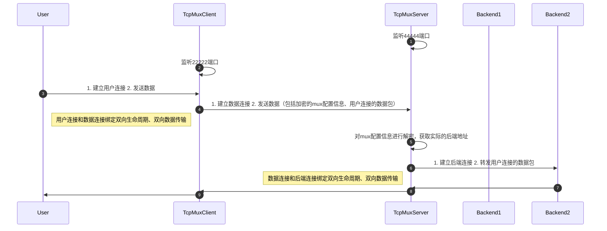

# tcp-reverse-proxy
基于[Vert.x](https://vertx.io/)实现的网络库。支持HTTP反向代理、TCP反向代理、TCP内网穿透、TCP单端口多路复用

开发环境

* jdk: 8
* vertx: 4.5.10

依赖引入，可以访问[mvnrepository.com](https://mvnrepository.com/artifact/top.meethigher/tcp-reverse-proxy)查看版本

```xml
<dependency>
    <groupId>top.meethigher</groupId>
    <artifactId>tcp-reverse-proxy</artifactId>
    <version>${tcp-reverse-proxy.version}</version>
</dependency>
<dependency>
    <groupId>io.vertx</groupId>
    <artifactId>vertx-core</artifactId>
    <version>4.5.10</version>
</dependency>
<!-- 若不使用http反向代理，可不加此依赖 -->
<dependency>
    <groupId>io.vertx</groupId>
    <artifactId>vertx-web</artifactId>
    <version>4.5.10</version>
</dependency>
<!-- 若不想添加日志，可只添加slf4j-api -->
<dependency>
    <groupId>ch.qos.logback</groupId>
    <artifactId>logback-classic</artifactId>
    <version>1.2.12</version>
</dependency>
<!-- 若不使用TCP内网穿透，可不加此依赖 -->
<dependency>
    <groupId>com.google.protobuf</groupId>
    <artifactId>protobuf-javalite</artifactId>
    <version>4.30.2</version>
</dependency>
```

## 一、HTTP反向代理

实现HTTP反向代理，代理路由优先级如下

1. `/local/*`↔️`http://127.0.0.1:888`
   * `http://127.0.0.1:8080/local/1`↔️`http://127.0.0.1:888/1`
   * `http://127.0.0.1:8080/local/1/2/3`↔️`http://127.0.0.1:888/1/2/3`
2. `/*`↔️`https://reqres.in`
   * `http://127.0.0.1:8080/api/users?page=2`↔️`https://reqres.in/api/users?page=2`

HTTP反向代理支持如下配置

1. 请求头转发客户端IP: 默认值F
2. 保留响应头Cookie: 默认值T
3. 保留请求头Host: 默认值F
4. 跟随跳转: 默认值T
5. 长连接: 默认值T
6. 日志及日志格式自定义
7. 代理服务完全接管跨域控制: 默认值F

```java
// addRoute第二个参数表示优先级，值越小、优先级越高
ReverseHttpProxy.create(vertx).port(8080)
        .addRoute(new ProxyRoute()
                .setName("proxy")
                .setSourceUrl("/local/*")
                .setTargetUrl("http://127.0.0.1:888"),-1)
        .addRoute(new ProxyRoute()
                .setName("proxy")
                .setSourceUrl("/*")
                .setTargetUrl("https://reqres.in"),1)
        .start();
```


## 二、TCP反向代理

实现TCP反向代理：`0.0.0.0:22`↔️`10.0.0.1:8080`

```java
ReverseTcpProxy.create(Vertx.vertx(), "10.0.0.1", 8080)
        .port(22)
        .start();
```

## 三、TCP内网穿透

虚线表示控制连接通信，实线表示非控制连接通信。

一些代码上的设计思路，参考[socket.io-client-java](https://github.com/socketio/socket.io-client-java/blob/socket.io-client-2.1.0/src/main/java/io/socket/client/Socket.java)



假如我有一个内网`SSH`服务`10.0.0.10:22`，需要通过`192.168.0.200:22`穿透出去。并且网络条件受限如下

1. `10.0.0.10`可以主动连接`192.168.0.200`
2. `192.168.0.200`无法主动连接`10.0.0.10`
3. 只要双方建立连接，即可实现双向数据传输

这就需要TCP内网穿透了。假设你内网穿透使用的控制端口为`44444`。

首先，在`192.168.0.200`这台机器，使用如下代码启动`TunnelServer`

```java
ReverseTcpProxyTunnelServer.create(Vertx.vertx())
        .port(44444)
        // 用于用户连接和数据连接的延迟判定，如果网络较差/DNS解析较慢的情况下，建议将该参数调大
        .judgeDelay(2000)
        .start();
```

在`10.0.0.10`这台机器，使用如下代码启动`TunnelClient`

```java
ReverseTcpProxyTunnelClient.create(Vertx.vertx())
        .backendHost("10.0.0.10")
        .backendPort(22)
        .dataProxyName("ssh-proxy")
        .dataProxyHost("192.168.0.200")
        .dataProxyPort(22)
        .connect("192.168.0.200", 44444);
```

## 四、TCPMux单端口多路复用

参考[RFC 1078 - TCP port service Multiplexer (TCPMUX)](https://datatracker.ietf.org/doc/html/rfc1078)

现有场景如下





上述场景代码实践

```java
// TCPMux Server
ReverseTcpProxyMuxServer.create(Vertx.vertx())
        .port(44444)
        .start();

// TCPMux Client
Map<MuxNetAddress, NetAddress> map = new LinkedHashMap<>();
map.put(new MuxNetAddress(6666, "HTTP-1"), new NetAddress("HTTP-1", 80));
map.put(new MuxNetAddress(6667, "HTTP-2"), new NetAddress("HTTP-2", 80));
map.put(new MuxNetAddress(6668, "SSH"), new NetAddress("SSG", 22));
NetAddress muxServerAddress = new NetAddress("10.0.0.1", 44444);
ReverseTcpProxyMuxClient.create(Vertx.vertx(), map, muxServerAddress)
        .start();
```


TCPMux实现思路




