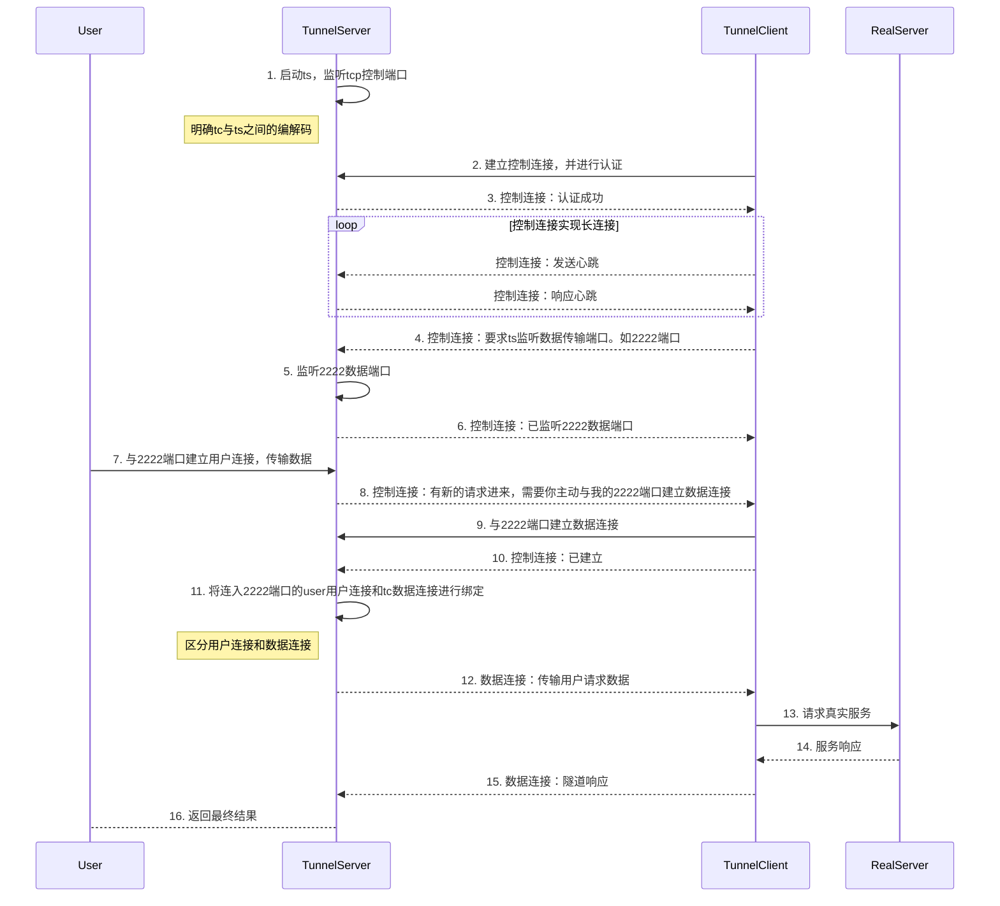

# tcp-reverse-proxy
基于[Vert.x](https://vertx.io/)实现的TCP反向代理与HTTP反向代理。

开发环境

* jdk: 8
* vertx: 4.5.10

依赖引入，可以访问[mvnrepository.com](https://mvnrepository.com/artifact/top.meethigher/tcp-reverse-proxy)查看版本

```xml
<dependency>
    <groupId>top.meethigher</groupId>
    <artifactId>tcp-reverse-proxy</artifactId>
    <version>${tcp-reverse-proxy.version}</version>
</dependency>
<dependency>
    <groupId>io.vertx</groupId>
    <artifactId>vertx-core</artifactId>
    <version>4.5.10</version>
</dependency>
<dependency>
    <groupId>io.vertx</groupId>
    <artifactId>vertx-web</artifactId>
    <version>4.5.10</version>
</dependency>
```

## TCP反向代理

实现TCP反向代理：`0.0.0.0:22`↔️`10.0.0.1:8080`

```java
ReverseTcpProxy.create(Vertx.vertx(), "10.0.0.1", 8080)
        .port(22)
        .start();
```

## TCP内网穿透

实现表示建立连接/监听端口等等。

虚线表示连接通信。

一些代码上的设计思路，参考[socket.io-client-java](https://github.com/socketio/socket.io-client-java/blob/socket.io-client-2.1.0/src/main/java/io/socket/client/Socket.java)




## HTTP反向代理

实现HTTP反向代理，代理路由优先级如下

1. `/local/*`↔️`http://127.0.0.1:888`
   * `http://127.0.0.1:8080/local/1`↔️`http://127.0.0.1:888/1`
   * `http://127.0.0.1:8080/local/1/2/3`↔️`http://127.0.0.1:888/1/2/3`
2. `/*`↔️`https://reqres.in`
   * `http://127.0.0.1:8080/api/users?page=2`↔️`https://reqres.in/api/users?page=2`

HTTP反向代理支持如下配置

1. 请求头转发客户端IP: 默认值F
2. 保留响应头Cookie: 默认值T
3. 保留请求头Host: 默认值F
4. 跟随跳转: 默认值T
5. 长连接: 默认值T
6. 日志及日志格式自定义
7. 代理服务完全接管跨域控制: 默认值F

```java
// addRoute第二个参数表示优先级，值越小、优先级越高
ReverseHttpProxy.create(vertx).port(8080)
        .addRoute(new ProxyRoute()
                .setName("proxy")
                .setSourceUrl("/local/*")
                .setTargetUrl("http://127.0.0.1:888"),-1)
        .addRoute(new ProxyRoute()
                .setName("proxy")
                .setSourceUrl("/*")
                .setTargetUrl("https://reqres.in"),1)
        .start();
```

 
